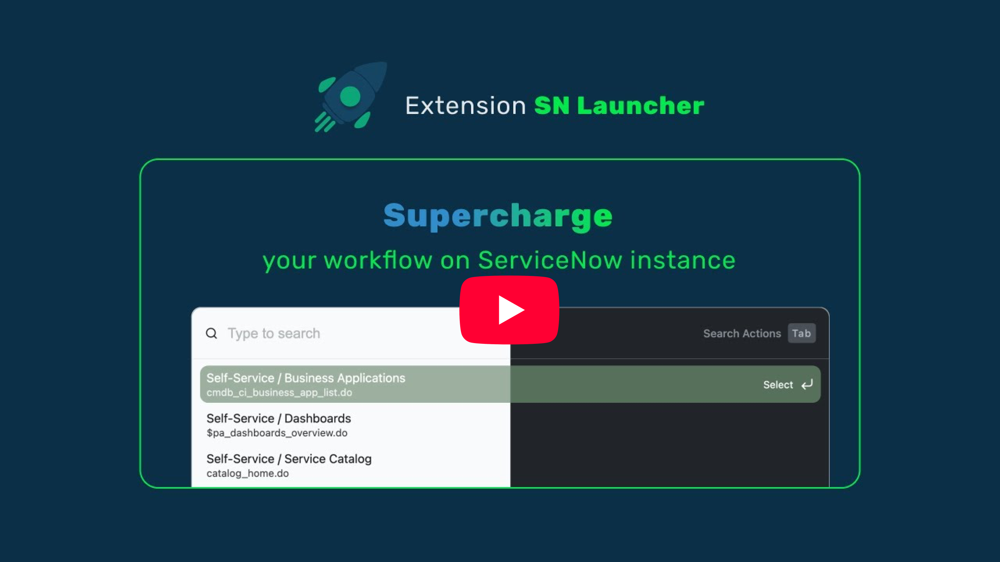

# SN Launcher

Supercharge your workflow on ServiceNow instance with a crafted command-palette interface.

## Quick start

### Step 1: install the extension

Install from [Chrome Web Store](https://chrome.google.com/webstore/detail/sn-launcher-servicenow-ut/pngglpnmlfdihkcdglcflibenhmcipmg) or [Firefox Add-ons](https://addons.mozilla.org/en-US/firefox/addon/sn-launcher/)

### Step 2: set the keyboard shortcut

1. Open browser extension page (e.g. `chrome://extensions/` or `about:addons`).
2. Find "SN Launcher" in the keyboard shortcuts section.
3. Set the shortcuts to your desired key combination.

### Step 3: use the extension

Press the keyboard shortcut to open the extension on any ServiceNow instance pages, or if you have pinned the extension to the toolbar, you can click the extension icon to open it.

## Complete features

- Quickly search and navigate between ServiceNow instance menus
- Productive action mode:
  - Find record by sysId
  - Search SN tables, history, developer documentation, and seismic components
  - Switch between application scopes
- Shortcut commands to instantly activate different action modes
- Dark mode

## 🔒 Privacy
- All operations are performed locally in your browser.
- No data is collected or shared with any third party.
- Manifest V3 is used to improve the privacy, security, and performance of the extension.

## License

[MIT](./LICENSE)
